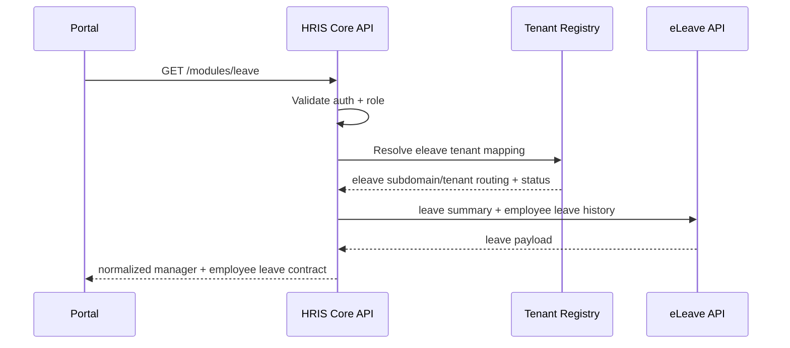

# eLeave Integration Implementation Guide

## 1. Objective

This guide describes how to integrate **eLeave** into HRIS with secure tenancy resolution, role-aware leave workflows, and contract-stable responses for frontend manager/employee experiences.

Target outcomes:

- unified leave module API in HRIS Core
- manager approvals and employee self-service flows in one contract
- tenant-safe calls into eLeave tenancy model

---

## 2. Business Logic (What eLeave contributes)

eLeave is the source for:

- leave balances by type
- leave application history
- pending/approved/rejected leave workflows
- leave utilization summaries

In HRIS, this powers:

- `/modules/leave`
- leave stats in `/dashboard/summary`
- leave slice in Employee 360

---

## 3. Integration Workflow



---

## 4. Secure Integration Rules

- Enforce `module_enabled("eleave")` before any leave call.
- Resolve tenant context server-side only.
- Guard employee ID override with self-or-privileged enforcement.
- Normalize output and hide module internals from clients.
- Apply fallback payloads carefully to preserve UX without leaking sensitive errors.

---

## 5. Step-by-Step Implementation (Code Path)

## Step 1: Verify eLeave client contract methods

In `hris-core-api/app/clients/eleave_client.py` implement/verify:

- `get_leave_summary(mapping, token)`
- `get_employee_leave_history(mapping, employee_id, token)`

Expected behavior:

- route through configured adapter mode/domain template
- include integration metadata headers
- normalize leave summary and history fields

## Step 2: Build leave module endpoint

Handler path: `hris-core-api/app/api/modules.py` (`/modules/leave`)

Execution flow:

1. resolve tenant mapping
2. enforce module active status
3. resolve canonical employee identity
4. fetch summary + history from eLeave
5. normalize:
   - manager stats
   - employee balances/history/holidays
6. blank manager section for employee persona

## Step 3: Align frontend leave page logic

Route: `/modules/leave`

Manager alignment:

- pending approvals, utilization stats, reporting shortcuts

Employee alignment:

- leave balances by type
- history timeline
- application action path

Note: if native HRIS write flows are not yet complete, legacy leave link remains fallback-only.

## Step 4: Keep contract stable under partial module failures

When eLeave calls fail:

- return safe default contract sections
- log correlation-rich diagnostics
- keep portal rendering functional

---

## 6. Minimal Code Blueprint

```python
def get_leave_module_data(user, employee_id=None):
    mapping = get_tenant_mapping(user.tenant_id)
    if not mapping.module_enabled("eleave"):
        raise HTTPException(status_code=403, detail="eLeave inactive for tenant")

    if employee_id:
        enforce_self_or_privileged(user, employee_id, context="Leave module lookup")
    resolved_employee_id = employee_id or resolve_canonical_identity(user).eleave.employee_id

    summary = eleave_client.get_leave_summary(mapping, user.raw_token)
    history = eleave_client.get_employee_leave_history(mapping, str(resolved_employee_id), user.raw_token)
    return normalize_leave_module_payload(summary, history, user)
```

---

## 7. HRIS Contract Shape

Expected response sections:

- `manager.stats` (`total_this_year`, `approved`, `pending`, `rejected`)
- `manager.pending_requests` (for approval queues)
- `employee.balances` (type, total, used, pending, color)
- `employee.history` (type, days, dates, status)
- `employee.holidays`

Normalization expectations:

- convert module-native date field names into frontend contract names
- keep leave type labels user-friendly
- keep numeric values explicit (integers/floats, not ambiguous strings)

---

## 8. Testing Checklist

- Role tests:
  - manager sees manager and employee segments
  - employee cannot access manager leave workload details
- Tenant tests:
  - disabled module returns `403`
  - inactive tenant returns `403`
- Data tests:
  - balances normalize correctly across leave types
  - history ordering and status mappings are stable
  - fallback contract remains frontend-safe when module errors occur

---

## 9. Operational Notes

- Include eLeave checks in `sync_check.py --live` before production releases.
- Track module probes in `hris_automation.module_probe_history`.
- Prefer opaque, user-safe errors in UI; keep actionable detail in server logs only.

---

## 10. Current Replica Alignment (Code-Verified)

From `modules/eLeave/backend`:

- tenancy model is path-based (`/{tenant}`) with Stancl tenancy initialization.
- authentication is currently Sanctum-oriented for tenant APIs.
- native routes used by HRIS fallback exist:
  - `GET /{tenant}/dashboard`
  - `GET /{tenant}/staff/{employee_id}/leaveHistory`
  - optional `GET /{tenant}/staff/myLeaveProgress`
- dedicated `/hris/*` contract routes are not present in current replica.

Implication:

- HRIS can read via fallback paths, but lacks a stable machine integration contract and centralized auth policy for cross-module orchestration.

---

## 11. Expected API Contract (Target for Module Team)

## 11.1 Required new integration routes

- `GET /hris/leaves/summary`
- `GET /hris/employees/{employee_id}/leaves`
- `GET /hris/integration/tenants`
- `GET /hris/integration/tenants/{tenant_id}/users`
- `POST /hris/integration/tenants/{tenant_id}/users/provision`

These routes should run through dedicated HRIS auth middleware, not tenant-frontend Sanctum assumptions.

## 11.2 Required request headers

| Header | Required | Notes |
|---|---|---|
| `Authorization` | yes | bearer user/service token |
| `X-Request-ID` | yes | traceability |
| `X-Client-App` | yes | must be `hris-core` |
| `X-Client-Version` | yes | caller version |
| `X-HRIS-Tenant-Id` | yes | source tenant context |
| `X-HRIS-User-Sub` | yes for user-context | principal |
| `X-HRIS-Role` | recommended | coarse role context |
| `X-HRIS-Employee-Id` | optional | employee-scoped requests |

## 11.3 Response envelope (recommended)

- `success`
- `message`
- `data`
- `meta` (`request_id`, `module`, `tenant_id`, `resolved_user_id`, `effective_role`, `timestamp`)

---

## 12. Environment Variables (Both Ends)

## 12.1 HRIS Core side

| Variable | Example |
|---|---|
| `ELEAVE_DOMAIN_TEMPLATE` | `https://{subdomain}.eleave.example.org` |
| `ELEAVE_SERVICE_TOKEN` | `<service-token>` |
| `ELEAVE_USE_TENANT_PATH` | `true` (current fallback) |
| `MODULE_ADAPTER_MODE` | `auto` |

## 12.2 eLeave module side (to implement/add)

| Variable | Example | Purpose |
|---|---|---|
| `HRIS_INTEGRATION_ENABLED` | `true` | gate `/hris/*` routes |
| `HRIS_SHARED_SECRET` | `<shared-secret>` | service endpoint auth |
| `HRIS_SERVICE_TOKEN` | `<service-token>` | optional additional auth |
| `KEYCLOAK_ISSUER` | `https://auth.example.org/realms/hris-platform` | JWT validation |
| `KEYCLOAK_JWKS_URL` | `https://auth.example.org/realms/hris-platform/protocol/openid-connect/certs` | key discovery |
| `KEYCLOAK_AUDIENCE_ELEAVE` | `eleave-api` | aud validation |

---

## 13. Delivery Checklist (eLeave Team)

1. Add `/hris/*` integration router with endpoints in section 11.
2. Implement HRIS auth middleware (shared secret/service token and optionally Keycloak JWT).
3. Resolve tenant context server-side using trusted mapping; never trust raw tenant path from external caller for integration routes.
4. Normalize leave summary/history payloads to HRIS contract shape.
5. Keep existing tenant-path Sanctum routes unchanged for current frontend clients.

---

## 14. API Request/Response Matrix (eLeave)

Success envelope (recommended):

- `success: true`
- `message: "ok"`
- `data: <payload>`
- `meta: { request_id, module, tenant_id, resolved_user_id, effective_role, timestamp }`

Failure envelope:

- `{"detail":"<error message>"}` with proper status code.

## 14.1 `GET /hris/leaves/summary`

### Request data required

- Headers:
  - `Authorization: Bearer <token>` (or service token)
  - `X-Request-ID`
  - `X-Client-App: hris-core`
  - `X-Client-Version`
  - `X-HRIS-Tenant-Id`
  - `X-HRIS-User-Sub`
  - `X-HRIS-Role`
- Query/body: none

### Success response (`200`) expected `data`

- `total_leaves_this_year`
- `approved_leaves`
- `pending_leaves`
- `rejected_leaves`
- `cancelled_leaves`
- `leave_utilization_rate`

### Failure responses

- `401`: invalid/missing auth token
- `403`: tenant not permitted/inactive
- `404`: tenant not found
- `422`: missing required headers
- `500`: unexpected server fault

## 14.2 `GET /hris/employees/{employee_id}/leaves`

### Request data required

- Path: `employee_id`
- Headers:
  - same required headers as summary endpoint
  - optional `X-HRIS-Employee-Id`

### Success response (`200`) expected `data`

- `employee_id`
- `balance`: object by leave type (for example `annual`, `sick`, `casual`)
- `used`: object by leave type
- `leaves`: array:
  - `type`
  - `days`
  - `status`
  - `start_date`
  - `end_date`

### Failure responses

- `401`, `403`, `404`, `422`, `500`

## 14.3 `GET /hris/integration/tenants`

### Request data required

- Headers:
  - `X-Request-ID`
  - `X-Client-App: hris-core`
  - `X-Client-Version`
  - `X-HRIS-Shared-Secret` (if configured)
  - `X-HRIS-Service-Token` (if configured)
- Query:
  - `limit` optional

### Success response (`200`) expected `data`

- `tenants`: array of tenant descriptors (`tenant_id`, `code`, `name`, status/routing metadata)
- `total`

### Failure responses

- `401`: invalid shared secret/service token
- `403`: invalid caller or insufficient privileges
- `422`: missing required integration headers
- `500`: unexpected server fault

## 14.4 `GET /hris/integration/tenants/{tenant_id}/users`

### Request data required

- Path: `tenant_id`
- Headers:
  - same integration headers as `integration/tenants`
- Query:
  - `limit` optional

### Success response (`200`) expected `data`

- `tenant_id`
- `users`: array:
  - `user_id`
  - `username`
  - `email`
  - `is_active`
  - `role_id`
  - `role_name`
  - `role_code`
  - `permissions`
  - `raw_permissions`
  - `is_admin`
  - `is_manager`
- `total`

### Failure responses

- `401`, `403`, `404`, `422`, `500`

## 14.5 `POST /hris/integration/tenants/{tenant_id}/users/provision`

### Request data required

- Path: `tenant_id`
- Headers:
  - `Content-Type: application/json`
  - `X-Request-ID`
  - `X-Client-App: hris-core`
  - `X-Client-Version`
  - `X-HRIS-Shared-Secret` (if configured)
  - `X-HRIS-Service-Token` (if configured)
  - `X-Idempotency-Key` (optional)
- JSON body:
  - required: `email`
  - optional: `username`, `first_name`, `last_name`, `user_id`, `idempotency_key`

### Success response (`200`) expected `data`

- `provisioned` (`true` or `false`)
- `idempotency_key`
- `user` object (same RBAC-rich shape as inventory endpoint)

### Failure responses

- `401`: invalid shared secret/service token
- `403`: invalid caller or insufficient privileges
- `404`: tenant not found
- `422`: invalid request body or tenant_id
- `500`: unexpected server fault
