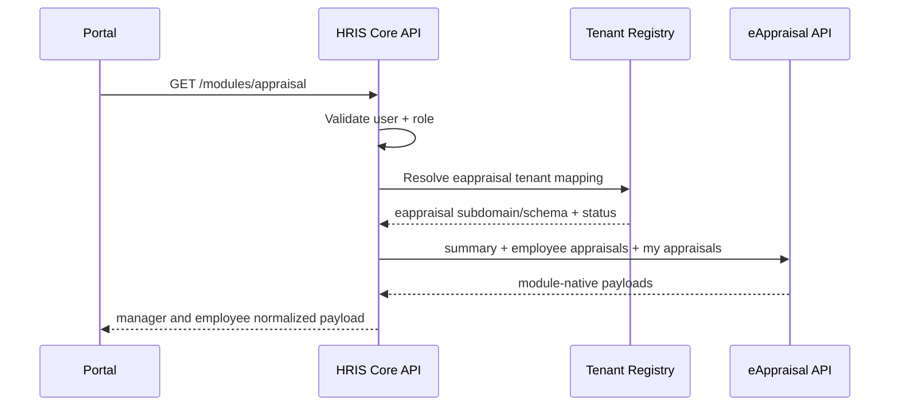

# Performance-Appraisal Integration Implementation Guide

## 1. Objective

This guide defines how to integrate **Performance Appraisal (eAppraisal)** into HRIS so manager and employee appraisal workflows run through a single, stable HRIS Core contract.

Target outcomes:

- Unified appraisal module payload for both manager and employee personas.
- Tenant-safe, role-safe retrieval from eAppraisal.
- Historical appraisal drilldown support for employee history.

---

## 2. Business Logic (What eAppraisal contributes)

eAppraisal is the source for:

- appraisal cycles
- section progress and scoring
- submission/review states
- historical appraisal records and ratings

In HRIS, this drives:

- `/modules/appraisal`
- `/modules/appraisal/history/{entry_id}`
- appraisal metrics in `/dashboard/summary`
- appraisal slice in Employee 360

---

## 3. Integration Workflow



---

## 4. Secure Integration Rules

- Do not trust client-provided employee IDs without role/self checks.
- Enforce `module_enabled("eappraisal")` before module calls.
- Resolve employee identity canonically for self workflows.
- Keep historical detail lookups scoped to resolved employee appraisals.
- Avoid leaking raw module errors to end users.

---

## 5. Step-by-Step Implementation (Code Path)

## Step 1: Verify eAppraisal client methods

In `hris-core-api/app/clients/eappraisal_client.py`, maintain:

- `get_appraisal_summary(mapping, token)`
- `get_employee_appraisals(mapping, employee_id, token)`
- `get_my_appraisals(mapping, token)`

Implementation requirements:

- support adapter mode and fallback mapping
- normalize keys used by frontend (`current_cycle`, `sections`, `goals`, history list)
- add correlation/integration metadata for observability

## Step 2: Build unified module endpoint

Primary handler: `hris-core-api/app/api/modules.py` (`/modules/appraisal`)

Flow:

1. resolve tenant mapping
2. enforce module active status
3. resolve employee identity
4. call eAppraisal summary + employee appraisals + self appraisals
5. transform and return:
   - `manager` section
   - `employee` section
6. blank manager section for non-manager personas

## Step 3: Implement history drilldown endpoint

Endpoint: `/modules/appraisal/history/{entry_id}`

Rules:

- only allow self-or-privileged access
- locate entry inside resolved employee appraisal list
- return normalized detail object
- return `404` for missing entry, not generic `500`

## Step 4: Frontend workflow alignment

Route: `/modules/appraisal`

Manager view alignment:

- cycle stats and pending/completed workload
- team progress and activity feed
- reminder/report actions

Employee view alignment:

- current cycle progress
- section completion and weights
- goals tracking and comments
- past appraisals and detail drilldown

---

## 6. Minimal Code Blueprint

```python
def get_appraisal_module_data(user, employee_id=None):
    mapping = get_tenant_mapping(user.tenant_id)
    if not mapping.module_enabled("eappraisal"):
        raise HTTPException(status_code=403, detail="eAppraisal inactive for tenant")

    if employee_id:
        enforce_self_or_privileged(user, employee_id, context="Appraisal module lookup")

    resolved_employee_id = employee_id or resolve_canonical_identity(user).eappraisal.employee_id
    summary = eappraisal_client.get_appraisal_summary(mapping, user.raw_token)
    employee_history = eappraisal_client.get_employee_appraisals(mapping, str(resolved_employee_id), user.raw_token)
    my_payload = eappraisal_client.get_my_appraisals(mapping, user.raw_token)
    return normalize_appraisal_module_payload(summary, employee_history, my_payload, user)
```

---

## 7. HRIS Contract Shape

Expected top-level payload:

- `manager.stats`
- `manager.team_stats`
- `manager.recent_activity`
- `employee.current_cycle`
- `employee.sections`
- `employee.goals`
- `employee.past_appraisals`
- `employee.trend_message`

History detail payload should include:

- `entry_id`, `cycle`, `status`, `score`, `rating`, `submitted`, `reviewed`, `reviewer`, `comments`, `date`

---

## 8. Testing Checklist

- Persona tests:
  - manager sees manager + employee sections
  - employee sees employee section, manager section hidden
- Access tests:
  - unauthorized employee ID access blocked
  - missing/inactive module returns `403`
- Data tests:
  - trend message logic stable with 0/1/2+ scores
  - history drilldown returns correct entry and `404` for unknown IDs

---

## 9. Operational Notes

- For live readiness checks, use:
  - `python hris-core-api/scripts/sync_check.py --live-eappraisal`
- Keep fixture mode (`eappraisal_fixture_file`) isolated to non-production environments.
- Persist probe and drift evidence for post-incident analysis.

---

## 10. Current Replica Alignment (Code-Verified)

From `modules/performance-appraisal/backend/app`:

- current native endpoints available and used by HRIS fallback:
  - `GET /api/dashboard/counts`
  - `GET /api/appraisals/submissions`
  - `GET /api/appraisals/cycles/list-my-appraisals`
  - `POST /api/auth/me`
- tenant schema resolution currently comes from `subdomain` header and tenant middleware.
- no dedicated `/api/hris/*` integration routes currently exist in the replica.

Implication:

- HRIS works in adapter fallback mode today, but contract stability and machine onboarding flows remain incomplete.

---

## 11. Expected API Contract (Target for Module Team)

## 11.1 Required new integration routes

- `GET /api/hris/v1/appraisals/summary`
- `GET /api/hris/v1/employees/{employee_id}/appraisals`
- `GET /api/hris/v1/integration/tenants`
- `GET /api/hris/v1/integration/tenants/{tenant_id}/users`
- `POST /api/hris/v1/integration/tenants/{tenant_id}/users/provision`

Compatibility aliases (same behavior):

- `/api/hris/...`

## 11.2 Required request headers

| Header | Required | Notes |
|---|---|---|
| `Authorization` | yes | bearer user or service token |
| `X-Request-ID` | yes | traceability |
| `X-Client-App` | yes | must be `hris-core` |
| `X-Client-Version` | yes | caller version string |
| `X-HRIS-Tenant-Id` | yes | resolved tenant context |
| `X-HRIS-User-Sub` | yes for user-context | principal identity |
| `X-HRIS-Role` | recommended | effective role context |
| `subdomain` | yes | existing module tenancy hint (current replica behavior) |

## 11.3 Response envelope (recommended)

Use HRIS integration envelope:

- `success`
- `message`
- `data`
- `meta` (`request_id`, `module`, `tenant_id`, `resolved_user_id`, `effective_role`, `timestamp`)

---

## 12. Environment Variables (Both Ends)

## 12.1 HRIS Core side

| Variable | Example |
|---|---|
| `EAPPRAISAL_DOMAIN_TEMPLATE` | `https://appraisal.{subdomain}.example.org` |
| `EAPPRAISAL_SERVICE_TOKEN` | `<service-token>` |
| `EAPPRAISAL_REFRESH_TOKEN` | `<refresh-token>` |
| `EAPPRAISAL_AUTO_REFRESH` | `true` |
| `EAPPRAISAL_SUBDOMAIN_HEADER` | optional override, e.g. `gi-kace` |
| `MODULE_ADAPTER_MODE` | `auto` |

## 12.2 Performance-Appraisal module side (to implement/add)

| Variable | Example | Purpose |
|---|---|---|
| `HRIS_INTEGRATION_ENABLED` | `true` | gate `/api/hris/*` routes |
| `HRIS_SHARED_SECRET` | `<shared-secret>` | service route auth pinning |
| `HRIS_SERVICE_TOKEN` | `<service-token>` | optional additional auth |
| `KEYCLOAK_ISSUER` | `https://auth.example.org/realms/hris-platform` | JWT validation |
| `KEYCLOAK_JWKS_URL` | `https://auth.example.org/realms/hris-platform/protocol/openid-connect/certs` | key discovery |
| `KEYCLOAK_AUDIENCE_EAPPRAISAL` | `eappraisal-api` | expected aud claim |

---

## 13. Delivery Checklist (Performance-Appraisal Team)

1. Add `/api/hris/v1` router with endpoint set in section 11.
2. Implement service-principal auth middleware for integration inventory/provision endpoints.
3. Reuse existing domain services to build normalized HRIS responses.
4. Preserve native `/api/*` contracts; do not break Angular/client dependencies.
5. Add integration tests for headers, role checks, tenant isolation, and error statuses.

---

## 14. API Request/Response Matrix (Performance-Appraisal)

Use this as the contract definition for implementation and QA.

Success envelope (recommended):

- `success: true`
- `message: "ok"`
- `data: <payload>`
- `meta: { request_id, module, tenant_id, resolved_user_id, effective_role, timestamp }`

Failure envelope:

- `{"detail":"<error message>"}` with proper status code.

## 14.1 `GET /api/hris/v1/appraisals/summary`

### Request data required

- Headers:
  - `Authorization: Bearer <token>` (or service token flow)
  - `X-Request-ID`
  - `X-Client-App: hris-core`
  - `X-Client-Version`
  - `X-HRIS-Tenant-Id`
  - `X-HRIS-User-Sub`
  - `X-HRIS-Role`
  - `subdomain`
- Query/body: none

### Success response (`200`) expected `data`

- `active_cycles`
- `pending_reviews`
- `completed_reviews`
- `overdue_reviews`
- `average_score`
- `completion_rate`

### Failure responses

- `401`: invalid/missing auth token
- `403`: tenant not allowed/inactive or role not permitted
- `404`: tenant/subdomain not resolved
- `422`: missing required headers
- `500`: unexpected server fault

## 14.2 `GET /api/hris/v1/employees/{employee_id}/appraisals`

### Request data required

- Path: `employee_id`
- Headers:
  - same required headers as summary endpoint

### Success response (`200`) expected `data`

- `employee_id`
- `appraisals`: array of:
  - `submission_id`
  - `appraisal_id`
  - `cycle_name`
  - `overall_score`
  - `rating`
  - `status`
  - `date`
  - `submitted`
  - `reviewed`
  - `reviewer`
  - `comments`

### Failure responses

- `401`, `403`, `404`, `422`, `500` as above

## 14.3 `GET /api/hris/v1/integration/tenants`

### Request data required

- Headers:
  - `X-Request-ID`
  - `X-Client-App: hris-core`
  - `X-Client-Version`
  - `X-HRIS-Shared-Secret` (if configured)
  - `X-HRIS-Service-Token` (if configured)
- Query:
  - `limit` optional

### Success response (`200`) expected `data`

- `tenants`: array with tenant descriptors (`tenant_id`, `code`, `name`, status/routing fields)
- `total`

### Failure responses

- `401`: invalid shared secret/service token
- `403`: invalid caller or insufficient privileges
- `422`: missing required integration headers
- `500`: unexpected server fault

## 14.4 `GET /api/hris/v1/integration/tenants/{tenant_id}/users`

### Request data required

- Path: `tenant_id`
- Headers:
  - same integration headers as `integration/tenants`
- Query:
  - `limit` optional

### Success response (`200`) expected `data`

- `tenant_id`
- `users`: array:
  - `user_id`
  - `username`
  - `email`
  - `is_active`
  - `role_id`
  - `role_name`
  - `role_code`
  - `permissions`
  - `raw_permissions`
  - `is_admin`
  - `is_manager`
- `total`

### Failure responses

- `401`, `403`, `404`, `422`, `500`

## 14.5 `POST /api/hris/v1/integration/tenants/{tenant_id}/users/provision`

### Request data required

- Path: `tenant_id`
- Headers:
  - `Content-Type: application/json`
  - `X-Request-ID`
  - `X-Client-App: hris-core`
  - `X-Client-Version`
  - `X-HRIS-Shared-Secret` (if configured)
  - `X-HRIS-Service-Token` (if configured)
  - `X-Idempotency-Key` (optional, recommended)
- JSON body:
  - required: `email`
  - optional: `username`, `first_name`, `last_name`, `user_id`, `idempotency_key`

### Success response (`200`) expected `data`

- `provisioned` (`true` or `false`)
- `idempotency_key`
- `user` object (same RBAC-rich user shape as inventory endpoint)

### Failure responses

- `401`: invalid shared secret/service token
- `403`: invalid caller or insufficient privileges
- `404`: tenant not found
- `422`: invalid request body or tenant_id
- `500`: unexpected server fault
