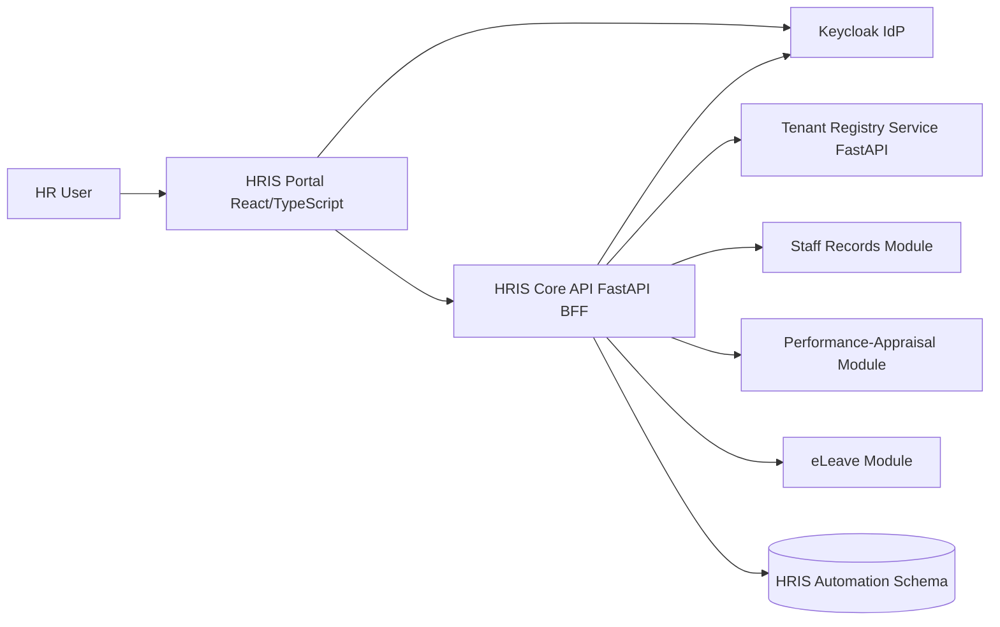
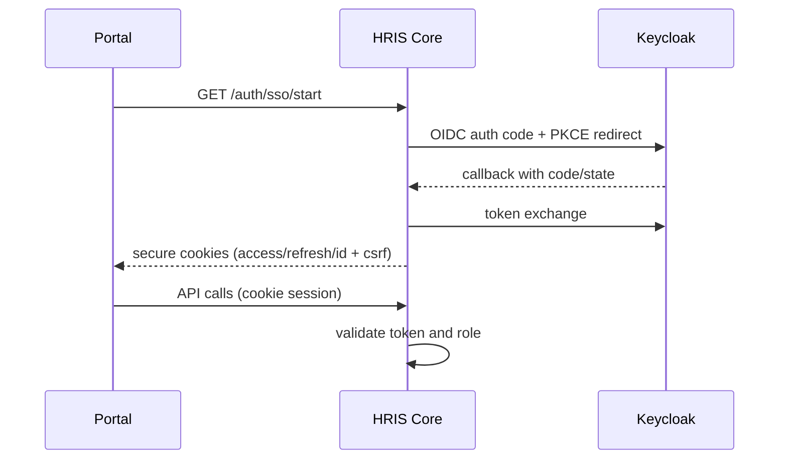
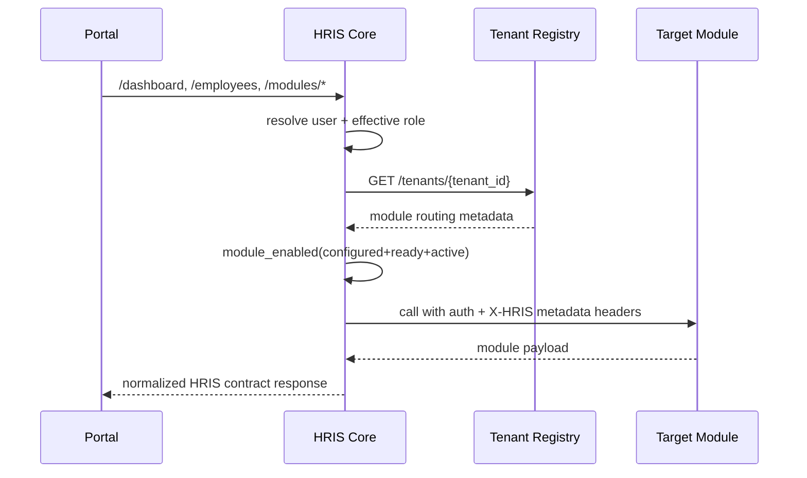
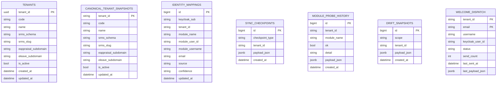
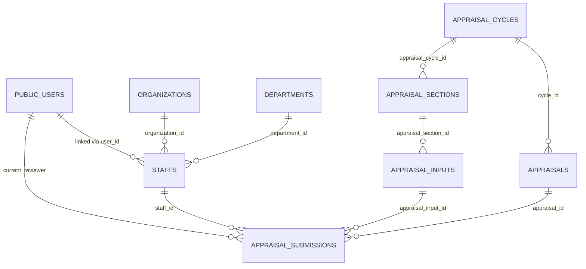
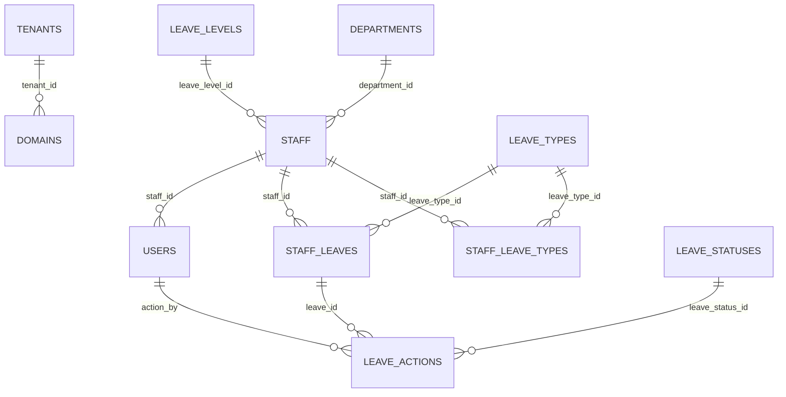

# HRIS System Design, ERD, and Module Sync Playbook

## 1) Purpose

This document is the implementation-grounded blueprint for the current HRIS codebase and replica production modules.

It covers:

- current architecture and workflow design
- database landscape (schemas, tables, and table intent)
- ER diagrams for HRIS control-plane and module data planes
- current integration maturity
- what each module team must implement to complete secure HRIS synchronization
- exact expected API contracts, headers, and environment variables on both ends

This is intended for backend, frontend, integration, and platform teams working in parallel.

---

## 2) Current System Topology

### Why this architecture

- Preserve module independence while delivering unified HRIS UX.
- Keep identity centralized in Keycloak.
- Keep tenant routing centralized in Tenant Registry.
- Keep integration safety/traceability in HRIS automation persistence.

---

## 3) Runtime Workflow (Current Codebase)

## 3.1 Authentication and session workflow

## 3.2 Backend request workflow

## 3.3 Frontend workflow

1. AuthProvider resolves dev mode or keycloak session mode.
2. Route-level role and capability checks control navigation.
3. HTTP client attaches CSRF and debug headers as needed.
4. Pages call Core endpoints only (not direct module endpoints).
5. UI renders manager vs employee variants from unified contracts.

---

## 4) Database Landscape and Design Rationale

The platform is intentionally split into control-plane and module data planes:

- **Tenant Registry DB**: canonical tenant routing/config.
- **HRIS Automation schema**: integration state, identity links, probes, drift.
- **SRMS DB**: public + schema-per-tenant.
- **Performance-Appraisal DB**: public + subdomain/schema tenancy.
- **eLeave DB**: central tenancy DB + tenant databases (Stancl tenancy).

This avoids coupling module transactional tables directly to HRIS orchestration state.

---

## 5) ERD - HRIS Control Plane

### What each control-plane table stores

- `tenants`: canonical routing metadata per tenant.
- `canonical_tenant_snapshots`: cached tenant map snapshot for automation tasks.
- `identity_mappings`: cross-system identity links (Keycloak subject to module identity).
- `sync_checkpoints`: timeline of sync run checkpoints.
- `module_probe_history`: module availability and auth probe history.
- `drift_snapshots`: tenant/user drift evidence for reconcile planning.
- `welcome_dispatch`: idempotent welcome notification state.

---

## 6) Module Data Model (Integration-Relevant)

## 6.1 Staff-Records (SRMS) - integration-relevant tables

- Public schema:
  - `organizations`: tenant organizations and metadata.
  - `user_mappings`: user-to-organization mapping for auth resolution.
- Tenant schema (`tenant_<org_uuid>`):
  - `users`, `employees`, `roles`, `permissions`, `tokens`, org structure tables.

HRIS dependency areas:

- employee roster/detail/self profile
- tenant inventory and tenant user inventory/provision APIs
- role/permission context for identity onboarding

## 6.2 Performance-Appraisal - integration-relevant tables

### Public schema

- `users`: account identity for sign-in and app-level user mapping.
- `refresh_tokens`: refresh token persistence.
- `organizations`: tenant organizations (name, subdomain, status, settings).
- `system_admin_role`: top-level system role metadata.

### Tenant/subdomain schema

- `staffs`: employee/person records tied to appraisal participants.
- `organization_roles`, `organization_permissions`, join tables:
  - `organization_role_permissions`
  - `organization_staff_permissions`
- `departments`, `department_units`, `employee_types`.
- `appraisal_cycles`: appraisal periods and scope.
- `appraisals`: appraisal definitions and cycle association.
- `appraisal_sections`, `appraisal_inputs`: section templates and questions.
- `appraisal_submissions`: actual staff appraisal data and review state.
- `appraisal_comments`, `feedbacks`: review comments and feedback trail.

## 6.3 eLeave - integration-relevant tables

### Central tenancy database

- `tenants`:
  - `id`, `status`, `name`, `logo`, `domain`, `data`
- `domains`:
  - domain to tenant binding

### Tenant database

- `staff`: employee records and supervisor relationships.
- `users`: tenant-authenticated users (Sanctum-based).
- `leave_types`, `leave_levels`: leave policy definitions.
- `staff_leave_types`: leave entitlements per staff and leave type.
- `staff_leaves`: leave applications and period details.
- `leave_statuses`: status dictionary.
- `leave_actions`: approval/recommend/reject/cancel action trail.
- `leave_days_update` + `vtotal_leave_days`: rolling leave balance adjustments.
- `departments`: department metadata for reporting and assignment.

---

## 7) ERD - Performance-Appraisal (Integration View)

---

## 8) ERD - eLeave (Integration View)

---

## 9) Integration Contract Expectations (Current HRIS Core)

## 9.1 Common outbound headers from HRIS Core

These are generated by Core adapters and sent to modules.

| Header | Purpose |
|---|---|
| `Authorization: Bearer <token>` | user token or service token |
| `X-Request-ID` | traceability/correlation |
| `X-Client-App: hris-core` | caller identity contract |
| `X-Client-Version` | caller version |
| `X-HRIS-Integration-Module` | module identifier (`srms`, `eappraisal`, `eleave`) |
| `X-HRIS-User-Sub` | principal identity (best effort from token) |
| `X-HRIS-Role` | effective HRIS role |
| `X-HRIS-Tenant-Id` | resolved tenant |
| `X-HRIS-Tenant-Slug` | tenant slug hint (when available) |
| `X-HRIS-Tenant-Code` | tenant code hint |
| `X-HRIS-Employee-Id` | employee context for employee-scoped calls |

## 9.2 Module-specific header additions

- SRMS may also receive:
  - `X-HRIS-Shared-Secret`
  - `X-HRIS-Service-Token`
  - `X-Session-Token`
  - `X-App-Type`
  - signed request headers (`X-Request-Timestamp`, `X-Request-Signature`, etc.)
- eAppraisal receives:
  - `subdomain` header
  - optional `cookie` override
- eLeave currently receives:
  - standard auth + X-HRIS metadata headers

---

## 10) Expected Module APIs (As of Current Core Adapters)

## 10.1 SRMS

Implemented/expected:

- `GET /api/hris/v1/employees/self/comprehensive`
- `GET /api/hris/v1/integration/tenants`
- `GET /api/hris/v1/integration/tenants/{tenant_id}/users`
- `POST /api/hris/v1/integration/tenants/{tenant_id}/users/provision`
- compatibility aliases under `/api/hris/integration/...`

Fallback/native:

- `/api/dashboard/summary`, `/api/employees`, `/api/employees/{id}`, `/api/organizations`

## 10.2 Performance-Appraisal

Current adapter uses:

- Preferred HRIS contract (not yet implemented in module replica):
  - `GET /api/hris/appraisals/summary`
  - `GET /api/hris/employees/{employee_id}/appraisals`
- Current native fallback:
  - `GET /api/dashboard/counts`
  - `GET /api/appraisals/submissions?staff_id={employee_id}`
  - `GET /api/appraisals/cycles/list-my-appraisals`
  - `POST /api/auth/me`

## 10.3 eLeave

Current adapter uses:

- Preferred HRIS contract (not yet implemented in module replica):
  - `GET /hris/leaves/summary`
  - `GET /hris/employees/{employee_id}/leaves`
- Current native fallback:
  - `GET /{tenant}/dashboard`
  - `GET /{tenant}/staff/{employee_id}/leaveHistory`
  - optional `GET /{tenant}/staff/myLeaveProgress`

---

## 11) Sync Status and Delivery Gaps

| Module | Current State | Major Gaps |
|---|---|---|
| Staff-Records | Partial sync in place with HRIS integration routes | finalize role/permission inventory consistency, harden auth/error matrix, complete sync automation evidence |
| Performance-Appraisal | fallback integration via native routes only | no `/api/hris/*` integration contract, no service-principal inventory/provision endpoints, no explicit module-side HRIS trust boundary |
| eLeave | fallback integration via tenant-path native routes only | no `/hris/*` contract endpoints, no Keycloak-first machine integration surface, no explicit tenant registry handshake from HRIS headers |

---

## 12) What Each Module Team Must Implement

## 12.1 Staff-Records (SRMS) completion tasks

1. finalize RBAC-rich tenant user inventory payload contract
2. enforce secret/service-token gates for integration endpoints
3. keep `/api/hris/v1/*` and `/api/hris/*` compatibility routes stable
4. keep self-comprehensive endpoint null-safe and UUID-safe
5. maintain idempotent provisioning semantics

## 12.2 Performance-Appraisal required implementation

1. add HRIS integration router under `/api/hris/v1`
2. implement:
   - `GET /api/hris/v1/appraisals/summary`
   - `GET /api/hris/v1/employees/{employee_id}/appraisals`
   - `GET /api/hris/v1/integration/tenants`
   - `GET /api/hris/v1/integration/tenants/{tenant_id}/users`
   - `POST /api/hris/v1/integration/tenants/{tenant_id}/users/provision`
3. support compatibility aliases under `/api/hris/...`
4. validate shared-secret/service identity for machine endpoints
5. keep native routes intact for backward compatibility
6. return stable envelope and status/error semantics

## 12.3 eLeave required implementation

1. add HRIS contract endpoints (tenant-resolved server-side):
   - `GET /hris/leaves/summary`
   - `GET /hris/employees/{employee_id}/leaves`
   - `GET /hris/integration/tenants`
   - `GET /hris/integration/tenants/{tenant_id}/users`
   - `POST /hris/integration/tenants/{tenant_id}/users/provision`
2. add Keycloak JWT or trusted service token middleware for HRIS routes
3. map `X-HRIS-Tenant-Id` to tenant context via Tenant Registry (or internal mapping adapter)
4. preserve Sanctum-based tenant app auth unchanged
5. return normalized HRIS envelope for machine integration

---

## 13) Environment Variables Matrix (Both Ends)

## 13.1 HRIS Core (already present)

Set these for production-like module integration:

| Variable | Example value |
|---|---|
| `AUTH_MODE` | `keycloak` |
| `USE_STUB_DATA` | `false` |
| `TENANT_REGISTRY_BASE_URL` | `https://tenant-registry.internal` |
| `TENANT_REGISTRY_BASIC_AUTH_USERNAME` | `hris_internal` |
| `TENANT_REGISTRY_BASIC_AUTH_PASSWORD` | `<strong-secret>` |
| `SRMS_BASE_URL` | `https://srms.example.org` |
| `EAPPRAISAL_DOMAIN_TEMPLATE` | `https://appraisal.{subdomain}.example.org` |
| `ELEAVE_DOMAIN_TEMPLATE` | `https://{subdomain}.eleave.example.org` |
| `MODULE_ADAPTER_MODE` | `auto` |
| `HTTP_CLIENT_TIMEOUT_SECONDS` | `10` |
| `SRMS_HRIS_SHARED_SECRET` | `<shared-secret>` |
| `SRMS_HRIS_SERVICE_TOKEN` | `<service-token>` |

## 13.2 Staff-Records module side

| Variable | Example value | Notes |
|---|---|---|
| `SRMS_HRIS_SHARED_SECRET` | `<shared-secret>` | must match Core outbound header |
| `SRMS_HRIS_SERVICE_TOKEN` | `<service-token>` | optional but recommended |
| `MODULE_TOKEN_SECRET` | `<jwt-signing-secret>` | if SRMS module token minting enabled |
| `SRMS_HRIS_INCLUDE_USER_RBAC` | `true` | include role/permission metadata in user inventory |

## 13.3 Performance-Appraisal module side (to add)

| Variable | Example value | Notes |
|---|---|---|
| `HRIS_SHARED_SECRET` | `<shared-secret>` | required for integration service endpoints |
| `HRIS_SERVICE_TOKEN` | `<service-token>` | optional second-factor for machine auth |
| `KEYCLOAK_ISSUER` | `https://auth.example.org/realms/hris-platform` | if JWT validation used |
| `KEYCLOAK_JWKS_URL` | `https://auth.example.org/realms/hris-platform/protocol/openid-connect/certs` | token verification |
| `KEYCLOAK_AUDIENCE_EAPPRAISAL` | `eappraisal-api` | expected audience |
| `HRIS_INTEGRATION_ENABLED` | `true` | feature-flag integration routes |

## 13.4 eLeave module side (to add)

| Variable | Example value | Notes |
|---|---|---|
| `HRIS_SHARED_SECRET` | `<shared-secret>` | machine endpoint protection |
| `HRIS_SERVICE_TOKEN` | `<service-token>` | optional service principal pin |
| `HRIS_INTEGRATION_ENABLED` | `true` | feature flag for `/hris/*` endpoints |
| `KEYCLOAK_ISSUER` | `https://auth.example.org/realms/hris-platform` | if JWT integration enabled |
| `KEYCLOAK_JWKS_URL` | `https://auth.example.org/realms/hris-platform/protocol/openid-connect/certs` | token verification |
| `KEYCLOAK_AUDIENCE_ELEAVE` | `eleave-api` | expected audience |

Security note: do not commit real secrets or production credentials into repo-tracked `.env.example` files.

---

## 14) End-to-End Module Workflow Alignment

## 14.1 Staff workflow alignment

- HRIS `/employees` and `/profile/me` map to SRMS employee records and self profile APIs.
- Employee 360 combines SRMS profile with appraisal and leave slices.

## 14.2 Performance workflow alignment

- Manager workflow: dashboard counts, team submissions, approvals/review.
- Employee workflow: personal appraisal cycles, submissions, progress.
- HRIS contract should abstract native schema details.

## 14.3 Leave workflow alignment

- Manager workflow: pending actions, leave utilization, reports.
- Employee workflow: leave balances, leave history, leave application.
- HRIS should read through stable `/hris/*` contract, not tenant-path internals.

---

## 15) Delivery Plan and Definition of Done

## Phase 1: Contract stabilization

- publish module-side `/hris` contract for Performance-Appraisal and eLeave
- freeze envelope shape and error status matrix

## Phase 2: Security hardening

- enforce shared secret and/or service token
- add request-id auditing and role-safe authorization checks

## Phase 3: Identity and onboarding readiness

- implement tenant inventory and tenant users inventory/provision in both remaining modules
- validate identity mapping ingestion in HRIS automation store

## Phase 4: Cutover confidence

- pass sync checker, module contract audit, and live probes
- no role-collapse regressions for imported users
- no tenant-mismatch incidents under integration load

---

## 16) Related Documents

- `docs/api-contracts/staff-records-integration-implementation-guide.md`
- `docs/api-contracts/performance-appraisal-integration-implementation-guide.md`
- `docs/api-contracts/eleave-integration-implementation-guide.md`
- `docs/api-contracts/hris-rbac-integration-api-handoff.md`
- `docs/api-contracts/srms-self-comprehensive-and-tenant-user-rbac-remediation-guide.md`
